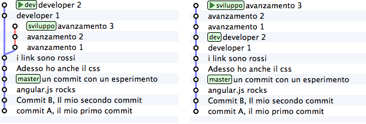

# GIT: Principali comandi ed esempi di workflow

## Table of Contents
 - [Utilities](#utilities)
 - [Impostazioni globali](#impostazioni-globali)
 - [Creare Repository](#creare-repository)
 - [Modifiche locali](#modifiche-locali)
 - [Tag](#tag)
 - [Commit history](#commit-history)
 - [Differenze](#differenze)
 - [Branch](#branch)
 - [Update and Publish](#update-and-publish)
 - [Merge Rebase](#merge-rebase)
 - [Stash](#stash)
 - [Conflicts](#conflicts)
 - [Undo](#undo)
 - [Comandi avanzati alias](#comandi-avanzati-alias)
 - [Gitflow](gitflow.md)

## Utilities
- Apre il browser con il readme di aiuto del comando specificato:  ` $  git nomecomando --help`
- Cerca nella working directory il testo 'pippo'  `$ git grep "pippo"`
- per pulire la finestra: ` $ git clean // -fd per forzare il cleaning`
- per avere tutti i riferimenti ai commit (anche quelli cancellati): ` $ git reflog`

## Impostazioni globali
Per settare l'utente e relativa email:
```
    > git config --global user.name "Lorenzo Corbella"
    > git config --global user.email "l.corbella@dstech.it"
```
Per vedere la lista dei parametri di configurazione: ` > git config --list`

## Creare Repository
- Creare un repository locale: ` $  git init`
- Clonare un repository remoto esistente. Il comando `clone` di fatto crea una nuova directory, stabilisce un 'upstream remote traking' con un repository remoto, fa il checkout sul branch attivo e riproduce in locale una copia completa della storia dei commit di un repository:  ` $  git clone https://github.com/Lorenzo74/gitCommands.git `
- Clonare branch specifici su github:
```
    // per clonare solo un branch specifico
    $  git branch -a // mostra tutti i branch presenti su remote
    $  git checkout -b nomebranch origin/nomebranch // scarica il branch nomebranch 
    // per avere tutti i branch di un repository
    $ mkdir mydir $  cd mydir
    $ git clone --mirror https://github.com/Lorenzo74/gitCommands.git .git 
    $ git config --bool  core.bare false 
    $ git reset --hard  
    // per usare un branch come template
    $ git clone -b brachchevogliocopiare https://github.com/Lorenzo74/gitCommands.git
```
[Go to top](#table-of-contents)

## Modifiche locali
- Verificare cosa è successo dall'ultimo commit:`$  git status`
- Aggiungere il file indicato, modificato rispetto all'ultimo commit, nello STAGE: `$  git add index.html`
- Aggiungere tutti i file modificati nello STAGE (l'eventuale flag -p richiede di confermare ogni singola modifica): `$  git add .`
- Rimuovere il file, precedentemente aggiunto, dallo STAGE, ma mantenendo le modifiche: `$  git reset-- index.html` o `git reset -q HEAD -- index.html`
- Committare i file indica salvare uno snapshot dello stage. Git committerà soltanto cambiamenti nello stage(index) e non i cambiamenti nella working directory. Git ragione per cambiamenti pertanto ogni commit ha un riferimento al proprio padre: `  $  git commit -m "Messaggio del commit"` . Il flag `-am` committa direttamente i file modificati dalla working area all'HEAD senza passare dallo stage.

- Se si è dimenticato qualcosa dall'ultimo commit, combinare i file nello stage e l'ultimo commit (creando nella history un nuovo commit): `  $  git commit --amend -m "New commit message `. Se non aggiungo il commento si apre un editor e posso modificare il commento. Con 'amend' cambia lo SHA dell'ultimo commit.
- Per vedere i dettagli di un commit:  `  $  git show 65476fa ` oppure  `  $  git show nome_tag `

## Tag
I 'tag' rappresentano dei bookmark 'personali' dei commit locali. 
- per avere una lista dei tag: `> git tag`
- Per marcare il commit corrente con un tag e poterlo in seguito confrontare con altri commit `$  git tag v1.0` 
- si taggare uno specifico commit si usa lo SHA: `  $  git tag nome_tag 4b8e1ad`.
- tramite flag -a si ottiene un tag annotato, (git apre un editor per inserire un msg): `$  git tag -a nome_tag 4b8e1ad`.
- per cancellare un tag: `  $  git tag -d nome_tag`.

NB: Per poi visionare un commit taggato si usa: `$ git show nome_tag` ma è più utile andare ad uno specifico punto del repository tramite `$ git checkout nome_tag`. in tale caso si entra nel `detached HEAD state`e si possono fare esperiementi o modifiche (per rimuoverle si usa `> git checkout -- nomefile`   metre per aggiungerle si deve fare un nuovo branch con `> git chechout -b nomebranch`).

- per condividere i tag in remoto si deve usare:  `  $  git push --tag nome_remote`.

### Esempio: workflow semplice
- Si crea una directory con `mkdir nomedir $  cd nomeDir`
- Si crea inizializza un progetto con git `$ git init`
- Si crea un file di readme con `$ copy con newFile ` oppure su linux `$ touch newFile`
- Si aggiunge il readme allo stage `$ git add newFile `
- Si crea uno snaphot delle modifiche con `$ git commit -m "newFile added" `
- Si guarda l'history delle modifiche con `$ git log `

[Go to top](#table-of-contents)

## Log: Commit history
- Mostra l'hash, l'autore e la data di tutti i commit partendo dal primo:  ` $  git log`
- Mostra le modifiche nel tempo di un unico file:  ` $  git log -p index.html`
- Mostra le modifiche ancora non incluse nel branch attuale rispetto a master:  ` $  git log ..master`
- Mostra chi ha cambiato, cosa e quando di un unico file:  ` $  git b lame index.html`
- Il flag `--stat` mostra l'hash, l'autore, la data e una sintesi dei file modificati, `--oneline` produce righe con hash e il msg del commit, mentre `--decorate` indica anche il branch e i tag, `--graph` disegna un grafico indicante il commit history, `--all` mostra tutti i commit. Si può formattare il log con `--pretty=format:"%cn committed %h on %cd"` o filtrare la commit history per data `git log --after="2014-7-1" --before="2014-7-4"` o per autore `git log --author="John"`, il flag `-n10` mostra gli ultimi 10 commit. 
- ` $ git shortlog` riporta una lista dei commit suddivisi per autore.

[Go to top](#table-of-contents)

## Differenze
- Mostra le differenze tra lo Stage e la working directory:  ` $  git diff  `
- Mostra le differenze tra l'HEAD e lo Stage:  ` $  git diff --staged `
- Mostra l’elenco delle modifiche che devo applicare a `from` perché il progetto diventi identico a quello fotografato in `to`:  ` $  git diff from to  `
- Mostra le differenze tra due commit: `$  git diff 65476fa 4b8e1ad `
- Mostra le differenze incluse tra due commit(il + recente prima, il + vecchio dopo): `$  git diff 65476fa..4b8e1ad `
- Mostrare le differenze tra due branch: `git diff branch_sorgente branch_target`
- Mostrare le differenze tra un tag e la working directory (il flag --stat indica un resoconto dei cambiamenti): `git diff v1.0`
- Mostrare un resoconto tra due branch:  `git diff --stat nomebranch1 nomebranch2`

[Go to top](#table-of-contents)

## Branch
Ogni qual volta si inizia una nuova feature, bugfix, o esperimento si deve creare un nuovo branch che sono dei semplici puntatori a commit, delle 'etichette' (nei trasizionali VCS invece sono di solito delle copie dei working files).
- Mostrare tutti i branch correnti:  `$  git branch -av `
- Per switchare ad un branch specifico:  `$  git checkout nomebranch `
- Creare un nuovo branch basato sull'ultimo commit (HEAD):  `$  git branch nomebranch`
- Crea un nuovo-branch e passa al nuovo branch:  `$  git checkout -b nuovo-branch`
- Crea un nuovo-branch e passa al nuovo branch partendo da dev:  `$  git checkout -b nuovo-branch dev`
- Creare un nuovo branch basato su un brach remoto:  `$  git checkout --track path/remote/branch `
- Cancellare un branch locale:  `$  git branch -d nomebranch `
- Cancellare un branch remoto:  `$  git branch -dr remote/branch`
- Il branch non sarà disponibile agli altri fino a quando non verrà inviato al repository remoto  `$ git push -u remote(origin) local-branch // -u sta per 'upstream`

[Go to top](#table-of-contents)

## Update and Publish
### Repository remoti
Il comando 'pull' è di fatto uno shortcut per 'fetch' seguito da 'merge' e può scaricare l'intero repository o uno specifico branch. Pushiare dei cambiamenti richiede prima che venga fatto un pull: questa azione può portare a dei conflitti nel merge, in quanto altri developer possono avere aggiornato file specifici prima di noi.
```
    $ git remote -v     // dà la lista dedi repository remoti
    $ git remote show https://gitlab.cloud.net/ApplicationSkeleton  // mostra informazioni del remote corrente
    $ git remote add nomebranch https://gitlab.cloud.net/nomebranch // aggiungi un repository remoto indicando il nome e l'URL e attivando il 'traking' di tale repository
    $ git remote rm nomebranch  // rimuove un repository remoto indicando il nome 

    $ git fetch nomeremote // scarica tutte le modifiche da nomeremote ma non le integra nell'HEAD
    $ git pull nomeremote // scarica tutte le modifiche da nomeremote e le integra mergiandole nell'HEAD
    $ git push nomeremote nomebranch  // pubblica le modifiche locali sul remoto
```

Quando si lavora con un repository condiviso è possibile vedersi rigettare un push in quanto altri hanno modifiche più recenti ai file nella local history. E' possibile risolvere con: ` git pull --rebase` e poi `git push origin/master`.

[Go to top](#table-of-contents)

## Merge & Rebase
In GIT ci sono due modi per integrare i cambiamenti da un ramo all'altro: `MERGE` e `REBASE`.

### Merge
Il comando merge crea un nuovo commit che include le modifiche provenienti da un commit contenente tutte le modifiche del branch di destinazione e un commit con tutte le modifiche del ramo di origine. E' un commit avente due padri. Si dice che si mergia il ramo di origine delle modifiche nel ramo di destinazione.
```
    $ git chechout master // si va nel ramo che riceverà (ramo di destinazione)
    $ git merge branch-to-integrate // si specifica da chi prendere i commit (ramo di origine)
```

### Rebase (Rifondazione) - rewriting history


Il comando rebase è particolarmente utilizzato per:

- spostare il ramo featurebranch all'estremità del master e tutti i commit di questo vengono inclusi nel ramo di destinazione. Si ha così una rifondazione della cronologia del featurebranch. Se il merge crea un singolo commit con due genitori preservando l'history non lineare, un rebase riporta i commit dal branch corrente su un altro producendo una history lineare. E' un modo automatizzato di eseguire in sequenza diversi cherry-pick.
```
    $ git chechout featurebranch     // si va nel ramo che vogliamo muovere
    $ git rebase branch-to-integrate // si specifica il nome del branch che ha i commit che voglio integrare nel mio featurebranch
```
- Combinare insieme diversi commit:
- troncare un branch prima di mergiarlo con git mege --no-ff nomebranch_troncato
- combinare i cambiamenti in un altro branch
- cambiare i precedenti commit (con un rebase interattivo)
```
    $ git rebase -i 3gt56er9  (o git rebase -i HEAD~4 per tornare indietro di 4)
```
Per il rebase interattivo si specifica il 1° commit precedente a quello da cui si vuole partire per poi applicare sui successivi delle operazioni ('pick' tiene il commit, 'swash' per combinarlo con il precedente tenendo il message). Si può modificare l'ordine e cancellare dei commit, rimuovendo semplicemente la riga: git poi aprirà l'editor per poi modificare i commenti dei commi risultanti (wq per chiudere l'editor).

### Cherry Pick
Per copiare un commit da un branch ad un altro si utilizza il comando cherry-pick. Il comando copia un commit creandone uno nuovo nel branch corrente con lo stesso msg dell'originale applicando le modifiche come se fosse un commit diverso: `  $ git cherry-pick 65476fa`
Il comando può essere utile in molti casi come ad esempio per correggere un bug a metà di un ramo: in questa situazione si deve tornare indietro nel tempo e riapplicare tutti i commit corretti tranne quello che ha generato il bug:
```
    git checkout master
    git branch --force feature
    git checkout feature
    git cherry-pick b5041f3
    git cherry-pick 8f41bb8
```
Cherry-pick si comporta proprio come `merge`. Se git non può applicare le modifiche per conflitti ti richiede di risolverli e di fare il commit manualmente.

[Go to top](#table-of-contents)

## Stash
Siamo nel mezzo dello sviluppo di qualche funzionalità, ma emerge la necessità di interrompere tutto per dedicarsi al bugfix sul commit precedente: non si può perdere il lavoro non committato e si accantona il codice non committatato (lo stato della working directory e dell'index) e si ritorna allo stato dell'ultimo commit con uno stato pulito della working directory.
```
    $ git stash -a "nomeStash"     // -a permette di dare un nome all'accantonamento
    $ git stash list               // elenca una coda di stash
    $ git stash apply              // quando si è pronti a ritornare da dove si era lasciato il comando riporta indietro ai cambiamenti fatti nella working directory
    $ git stash pop                // uguale a apply ma rimuove lo stato dallo stash list
    $ git stash drop [stash_ref]   // rimuove l'ultimo stash
    $ git stash clear              // pulisce la lista di stash
    $ git stash branch testchanges // crea un branch da uno stash
```
[Go to top](#table-of-contents)

## Conflicts
Per risolvere i conflitti si utilizzano vari tool. Per incorporare un altro branch nel branch attivo si utilizza `$ git merge nomebranch`, e git prova ad auto-incorporare le modifiche. Sfortunatamente, a volte questa procedura automatizzata non è possibile, ed in questo caso ci saranno dei conflitti che dovranno essere sistemati manualmente modificando i file che git mostrerà. Dopo aver cambiato questi files, si devono marcare come 'correttamente incorporati' tramite 'git add nomedelfileeditato' e poi committare le modifiche/il merge.
```
    <<<<<<<<< HEAD indica ciò che è contenuto nel branch corrente

    ========= separatore

    >>>>>>>>> nomedelbranch

     $ git mergetool    // usa il tool configurato per risolvere i conflitti
     $ git diff branch_sorgente branch_target
     $ git add resolved-file   // marcare i file  risolti manualmente
     $ git commit              // committare i cambiamenti del merge
```
[Go to top](#table-of-contents)

## Undo
Per vedere temporaneamente un commit "spostandosi nel tempo":
```
    $ git checkout 65476fa 
    $ git checkout 65476fa index.html // per vedere temporanemante solo un file
    $ git checkout master             // per tornare allo stato “current” del progetto
```
Quando ci si muove tra i commit, git avvisa che non si è attaccati ad un branch per cui qualsiasi modifica non avrà impatto sulla posizione di alcun branch (e suggerisce anche di crearne uno col comando git checkout -b): HEAD sta puntando direttamente al commit e non ad un branch. Lo stato in cui HEAD non punta ad un branch viene chiamato `detached head` e si è rimossi dalla history dei commit.

Da notare che se modifico dei file ma non li aggiungo all'index una volta che faccio il checkout ad un certo commit git riporta un errore dicendo che le modifiche locali sarebbero sovrascritte dal checkout e che è richiesto di committare le modifiche o fare uno stash.

### reset 
Il comando `reset` cambia dove il branch corrente punta. Elimina le modifiche locali nella working directory e nell'index, ritornando all'ultimo committed state (non è da usare in un repository condiviso con commit pushiati da altri...)
```
$ git reset --hard HEAD // HEAD si può omettere sta per branch corrente
```
Il flag ` --hard ` aggiorna la working area facendola combaciare con l'index, in altre parole ogni modifica presente nella working area locale non saranno preservate. Fare l'undo dell'ultimo commit è svolto con: `$ git reset --soft HEAD~1`.
Un possibile scenario potrebbe essere, si è fatto un commit non pushiato sul remoto, poi si decide di rimuoverlo con `git reset`, modificando la storia come se non fosse mai esistito.

### checkout
Il comando checkout prende il commit indicato e lo copia nel file system e nella staging area, e non si hanno modifiche alla commit history. Nel caso si abbia qualcosa di sbagliato si può sostituire i cambiamenti fatti in locale, non ancora committati,  con il comando `git checkout -- nomedelfile` o `git checkout -- .` questo rimpiazza le modifiche nella working area con l'ultimo contenuto presente in HEAD. I cambiamenti fatti ed aggiunti all'index, così come i nuovi files, verranno mantenuti. La differenza fondamentale tra `reset` e `checkout` sta in come l'index è interessato dai due comandi: `checkout` ripristina la working directory allo stato del commit, i file sono aggiunti e rimossi), mentre nel reset è come se i commit non fossero mai esistiti.
Un possibile scenario potrebbe essere mettere dei file modificati nell'index senza committarli. Tramite `git checkout` si riottiene una working area pulita ma con l'index ancora presente.

### revert
E' possibile inoltre fare un revert del commit (producendo un nuovo commit con modifiche opposte, si cancella quindi commit pubblicati con nuovi commit che prevengono la perdita della commit history. E' utile quando un commit ha introdotto dei bug che possono essere rimossi facendo il revert delle modifiche in precedenza applicate. E' la modalità di UNDO considerata + sicura.
```
    $ git revert 65476fa
    $ git revert HEAD~2..HEAD // fa il revert degli ultimi due commit
```

Ritornare indietro al commit indicato, modificando l'history dei commit.
```
    $ git reset --hard 65476fa  // ...elimina le modifiche locali nella working directory
    $ git reset  65476fa        // ...preserva le modifiche dei commit successivi a quello indicato e messi come unstaged
    $ git reset HEAD readme.md  
    // cancella le modifiche aggiunte allo stage e ripristina il file alla versione dell'ultimo commit (poi dovrà essere fatto git checkout -- readme.md per tornare insietro all'ultimo stato pulito...)
    $ git reset --keep 65476fa // ...e preserva modifiche locali non committate.

    // If I want to keep the last changes...
    $ git stash -a "feature"
    $ git reset --hard 65476fa
    $ git stash apply "feature"
```

[Go to top](#table-of-contents)

## Comandi avanzati alias

Gli alias sono contenuti in una sezione dedicata dei settings:

` > cat .git/config | grep -A 1 "\[alias\]"`

Utilizzando gli alias è possibile semplificare i comandi di git impartiti da terminale (quelli globali, quelli del progetto attuale etc):

- shorthand del git status: 
` > git config --global alias.st status --short --branch` o `-sb`

- shorthand per committare tutti i file modificati:
` > git config --global alias.cma "commit --all -m"`

- shorthand per quick merge: si lavora in un branch e poi si mergia in master con l'unione di due comandi:
` > git config --global alias.qm '!git checkout $1; git merge @{-1}'` si usa con: 
` > git qm master`

- shorthand per il log:
` > git log --pretty='%h | %d %s (%cr) [%au]`

` > git log --pretty='%Cred%h%Creset | %C(yellow)%d%Creset %Cgreen%s%Creset (%C(cyan)%cr%Creset) %Cred[%au]%Creset --graph --all`

` > git config --global alias.lg "log --pretty='%Cred%h%Creset | %C(yellow)%d%Creset %Cgreen%s%Creset (%C(cyan)%cr%Creset) %Cred[%au]%Creset --graph --all"`

- shorthand per git diff:
` > git config --global core.pager 'less -RFX' `
` > git config --global alias.dp 'diff --word-diff --unified=10 --histogram' `

[Go to top](#table-of-contents)