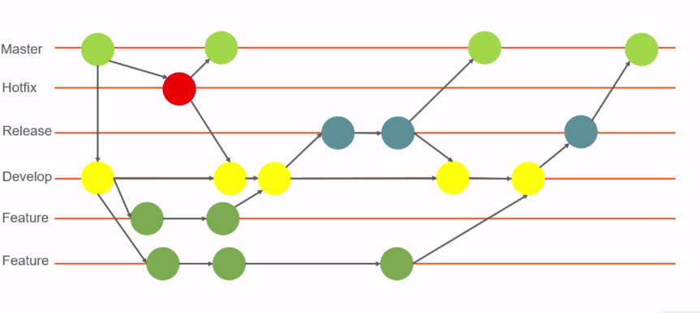

# Gitflow Principali comandi ed esempi di workflow

## Table of Contents
 - [Introduzione](#introduzione)
 - [Inizializzazione](#inizializzazione)
 - [Features](#features)
 - [Release](#release)
 - [Hotfix](#hotfix)
 - [Help](#help)
 - [Links](#help)

## Introduzione

Gitflow è un set di istruzioni che definisce un branching model avanzato creato da  [Vincent Driessen](http://nvie.com/posts/a-successful-git-branching-model/). Ci sono altre strategie riconosciute di branching quali il modello centralised (un unico server centralizzato a cui tutti i developer pullato e pushano modifiche locali), il feature branch (ogni sviluppatore crea un proprio branch per la propria attività) etc. Gitflow, anche se più complicato permette una maggiore flessibilità in quanto la storia del progetto è tracciata da due branch, generalmente `master`, e `develop` e ogni feature e ogni bugfix risiede nel proprio branch (che una volta terminati sono mergiati sia su master che develop). Una volta pronti si può fare un branch di release in cui finiscono tutti gli hotfix (branch di master) ed i feature branch (branch di develop).

Git-flow è una soluzione basata sul merge. Non esegue il rebase su i feature branch.

## Inizializzazione
Git flow ha la necessità di essere inizializzato all'interno di un progetto git: `> git flow init` . E' richiesto di rispondere ad alcune domande relative alla naming conventions per i branch. E' raccomandato l'uso dei valori di default.

## Features 
I feature branch sono usati per contenere il codice relativo ad una singola feature. Si inizia dal branch `develop`:
```
> git flow feature start MYFEATURE   // crea un branch partendo da develop
> git flow feature finish MYFEATURE  // mergia e si sposta su develop ed event. cancella il feature branch su locale e su remoto
> git flow feature publish MYFEATURE    // pubblica la feature per essere disponibile anche agli altri creando un remote branch
> git flow feature pull origin MYFEATURE // scaricare una feature pubblicata
> git flow feature track MYFEATURE      // si traccia una feature (si fà il checkout su tale branch e si può fare commit)

```  
Una volta che la feature è pubblicata sul develop  ogni branch che partirà da questo conterrà la feature, ma la feature non è live (su master), per far questo si deve fare una release.

[Go to top](#table-of-contents)

## Release
I Release branch contengono tutte le feature mergiate su develop:
```
> git flow release start RELEASE  [BASE]  // si crea la release come branch di develop: [BASE] è l'eventuale sha di partenza
> git flow release publish RELEASE  // si pubblica
> git flow release track RELEASE    // si traccia la release
> git flow release finish RELEASE   // si mergia su master e (all'indietro)su develop, eventuale rimozione del release branch e tag della release con il suo nome e si finisce su develop
> git push --tags   // si pushia sia i commit locali che i tag creati sul remote
 
```
Una volta create le release devono essere testate e fatti tutti i fix del caso prima di terminarla.

[Go to top](#table-of-contents)

## Hotfix
Gli Hotfixes nascono dalla necessità di agire immediatamente di fronte ad uno stato indesiderato della versione live (master) e possono essere fatti partire dal tag corrispondente sul branch master che contrassegna la versione di produzione:
```
    > git flow hotfix start VERSION [BASENAME]  // si stacca da master un branch hotfix
    > git flow hotfix publish VERSION          // si pubblica il branch in remoto
    > git flow hotfix track/pull VERSION       // si scarica il branch in remoto
    > git flow hotfix finish VERSION    // merge in 'develop' e in 'master', solo il master viene taggato con la versone dell'hotfix, eventualmente l'hotfix local branch viene creato e si riposiziona su develop
```


[Go to top](#table-of-contents)

## Help 
E' possibile listare gli aiuti aggiungendo al macrocomando:`  > git flow feature help`

## Links:
- [gitflow cheatsheet](http://danielkummer.github.io/git-flow-cheatsheet/index.it_IT.html)


